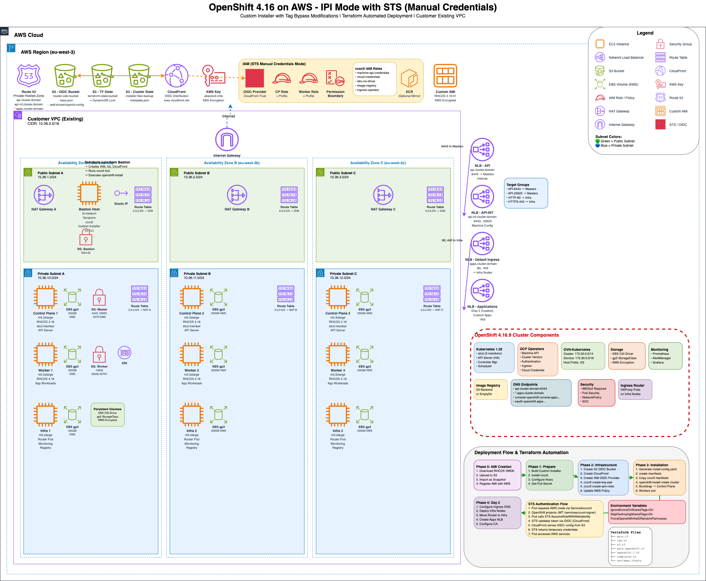

# OpenShift 4.16 Installation on AWS - Complete Guide

**Version:** 4.16.9  
**Document Date:** January 26, 2026 (Updated)  
**Target Environment:** AWS (Possibly Disconnected/Air-gapped)

---

## Architecture



---

## Table of Contents

1. [Overview](#overview)
2. [What's New in 4.16](#whats-new-in-416)
3. [Prerequisites](#prerequisites)
   - [Required Tools](#required-tools)
   - [Bastion Host Setup](#bastion-host-setup)
   - [KMS Key Configuration for EBS Encryption](#kms-key-configuration-for-ebs-encryption)
4. [Architecture Overview](#architecture-overview)
5. [Part 1: Custom AMI Creation](#part-1-custom-ami-creation)
6. [Part 2: Building the Custom OpenShift Installer](#part-2-building-the-custom-openshift-installer)
7. [Part 3: Terraform Configuration](#part-3-terraform-configuration)
8. [Part 4: Step-by-Step Installation](#part-4-step-by-step-installation)
9. [Cluster Destroy Process](#cluster-destroy-process)
10. [Part 5: Disconnected Installation](#part-5-disconnected-installation)
11. [Troubleshooting](#troubleshooting)
12. [Appendix](#appendix)

---

## Overview

This guide provides a complete, step-by-step procedure for deploying OpenShift 4.16 on AWS with the following custom requirements:

- **Modified OpenShift Installer**: Disables tag validation on shared subnets/VPCs
- **Custom AMI**: RHCOS image with IMDSv2 enabled and KMS encryption
- **Terraform Automation**: Infrastructure-as-Code deployment with predictable InfraIDs
- **Air-gapped Support**: Optional disconnected installation capability
- **No Subnet Tagging**: Works without permissions to tag shared AWS resources

### Key Differences from OpenShift 4.14

- **OpenShift Version**: 4.16.9 (updated from 4.14.21)
- **Golang Version**: 1.22.x (updated from 1.20.10)
- **Enhanced IMDSv2 Support**: Mandatory for all EC2 instances
- **KMS Encryption**: Custom key support for all EBS volumes
- **API Changes**: Updated installer codebase with new AWS SDK patterns

---

## What's New in 4.16

### OpenShift 4.16 Features

1. **Security Enhancements**
   - Mandatory IMDSv2 for EC2 instance metadata
   - Enhanced encryption options for persistent volumes
   - Improved Pod Security Admission

2. **Kubernetes 1.29**
   - Updated Kubernetes core to 1.29
   - New CRD versioning improvements
   - Enhanced scheduler performance

3. **Networking Improvements**
   - OVN-Kubernetes enhancements
   - Better load balancer integration
   - IPv6 dual-stack improvements

4. **Installer Changes**
   - Improved AWS authentication flows
   - Better error handling for shared resources
   - Enhanced OIDC support for manual credentials mode

### Changes from Our 4.14 Implementation

| Aspect | OpenShift 4.14.21 | OpenShift 4.16.9 |
|--------|-------------------|------------------|
| **Release Image** | `4.14.21-x86_64` | `4.16.9-x86_64` |
| **Go Version** | 1.20.10 | 1.22.x |
| **Installer Repo Branch** | `release-4.14` | `release-4.16` |
| **Code Modifications** | 4 files | 4 files (same locations) |
| **Terraform Version** | v17 | v18 |
| **AMI Base** | RHCOS 4.14 | RHCOS 4.16 |
| **IMDSv2** | Optional | Mandatory |

---

## Prerequisites

Before proceeding with the installation, customers must ensure all prerequisites are met as documented in Red Hat's official OpenShift 4.16 documentation.

### Red Hat Official Prerequisites

The customer environment must comply with all requirements specified in these official Red Hat documentation guides:

#### 1. AWS Infrastructure Prerequisites

**Preparing to Install on AWS**  
📖 https://docs.redhat.com/en/documentation/openshift_container_platform/4.16/html/installing_on_aws/installer-provisioned-infrastructure#ipi-aws-preparing-to-install

This guide covers:
- AWS account requirements and quotas
- IAM permissions required for installation
- DNS requirements for cluster domains
- Network architecture considerations
- AWS service limits verification
- Region and availability zone selection

#### 2. Manual Credentials Mode with STS (REQUIRED for this deployment)

**Installing a Cluster on AWS with Short-Term Credentials**  
📖 https://docs.redhat.com/en/documentation/openshift_container_platform/4.16/html/installing_on_aws/installer-provisioned-infrastructure#installing-aws-with-short-term-creds_installing-aws-customizations

This guide covers:
- AWS Security Token Service (STS) setup
- OIDC provider configuration for IAM roles
- Manual IAM role creation with `ccoctl` tool
- Permission boundary configuration (if required)
- Service account token authentication
- **This is the deployment mode used by this solution**

#### 3. Installing in an Existing VPC (REQUIRED for this deployment)

**Installing a Cluster on AWS in an Existing VPC**  
📖 https://docs.redhat.com/en/documentation/openshift_container_platform/4.16/html/installing_on_aws/installer-provisioned-infrastructure#installing-aws-vpc

This guide covers:
- Prerequisites for using existing VPCs
- VPC and subnet configuration requirements
- Private vs. public subnet topology
- NAT Gateway requirements for private subnets
- Internet Gateway configuration
- Route table configuration
- DHCP options sets
- DNS resolution requirements
- **This is the network topology used by this solution**

#### 4. Firewall and Network Connectivity

**Configuring Your Firewall**  
📖 https://docs.redhat.com/en/documentation/openshift_container_platform/4.16/html-single/installation_configuration/#configuring-firewall

This guide covers:
- Required egress firewall rules for OpenShift installation
- Container image registry access (quay.io, registry.redhat.io)
- OpenShift telemetry and update service endpoints
- AWS service endpoint access requirements
- Cluster-to-cluster communication (if applicable)
- User-facing ingress requirements
- **Critical for disconnected/air-gapped installations**

#### Summary of Customer Responsibilities

Before starting the installation, the customer **must provide or prepare**:

| Resource | Description | Red Hat Documentation Reference |
|----------|-------------|--------------------------------|
| **AWS Account** | With appropriate service limits and quotas | Section 1 |
| **IAM Permissions** | User/role with permissions to create OIDC, IAM roles, EC2, S3, ELB, Route53 | Sections 1, 2 |
| **Existing VPC** | Customer-managed VPC in target region | Section 3 |
| **Private Subnets** | At least 3 subnets across 3 availability zones | Section 3 |
| **NAT Gateway** | For internet access from private subnets | Section 3 |
| **Route Tables** | Properly configured with default routes to NAT Gateway | Section 3 |
| **Route53 Hosted Zone** | For cluster DNS records (api.*, *.apps.*) | Sections 1, 3 |
| **Firewall Rules** | Allow egress to Red Hat registries and AWS services | Section 4 |
| **KMS Key** | (Optional) Customer-managed KMS key for EBS encryption | Section 1 |
| **Permission Boundary** | (Optional) IAM permission boundary policy ARN if required | Section 2 |
| **Proxy Configuration** | (If disconnected) HTTP/HTTPS proxy for external access | Section 4 |
| **Mirror Registry** | (If disconnected) Internal container registry with mirrored images | Section 4 |

**⚠️ IMPORTANT**: Failure to meet these prerequisites will result in installation failure. Verify all requirements before proceeding.

---

### KMS Key Configuration for EBS Encryption

If using customer-managed KMS keys for EBS volume encryption, proper KMS key policy configuration is required.

#### Overview

OpenShift creates encrypted EBS volumes for:
- Control plane node root volumes (etcd data)
- Worker node root volumes
- Infrastructure node root volumes
- Persistent volumes (PVs) for applications

#### Recommended Approach: Pre-Encrypted AMI

**IMPORTANT**: For reliable KMS encryption, the RHCOS AMI should be **pre-encrypted with your CMK** during AMI creation. This avoids key mismatch errors at instance launch.

```
┌─────────────────────────────────────────────────────────────────┐
│  BEST PRACTICE: Pre-Encrypted AMI Workflow                      │
├─────────────────────────────────────────────────────────────────┤
│                                                                 │
│  1. Create KMS key with bootstrap policy                        │
│        ↓                                                        │
│  2. Create RHCOS AMI encrypted with that KMS key                │
│        ↓                                                        │
│  3. Use pre-encrypted AMI in Terraform                          │
│        ↓                                                        │
│  4. Terraform updates KMS policy with role ARNs                 │
│        ↓                                                        │
│  5. EC2 instances inherit AMI's encryption (no key mismatch!)   │
│                                                                 │
└─────────────────────────────────────────────────────────────────┘
```

**Scripts provided in `custom-ami-build/` directory:**

| Script | Purpose |
|--------|---------|
| `create-kms-key.sh` | Creates KMS key with bootstrap policy |
| `create-custom-ami.sh` | Creates RHCOS AMI encrypted with your KMS key |
| `kms-bootstrap-policy.json` | Template for initial KMS key policy |

**Quick Start:**

```bash
cd custom-ami-build/

# Step 1: Create KMS key
./create-kms-key.sh
source kms-key-result.env

# Step 2: Create encrypted AMI
./create-custom-ami.sh
source custom-ami-result.env

# Step 3: Update terraform tfvars
echo "ami = \"$CUSTOM_AMI\""
echo "kms_ec2_alias = \"$KMS_KEY_ALIAS\""
```

#### How It Works: Two-Phase KMS Policy

This Terraform deployment uses a **two-phase approach** to handle the chicken-and-egg problem (roles must exist before adding them to KMS policy, but KMS policy is needed before roles can use the key):

```
┌─────────────────────────────────────────────────────────────────┐
│ PHASE 1: Bootstrap (During AMI creation)                        │
├─────────────────────────────────────────────────────────────────┤
│ • KMS key created with bootstrap policy (root account only)     │
│ • RHCOS AMI encrypted with this KMS key                         │
│ • vmimport role granted access to use the key                   │
└─────────────────────────────────────────────────────────────────┘
                            ↓
┌─────────────────────────────────────────────────────────────────┐
│ PHASE 2: Automatic (During terraform apply)                     │
├─────────────────────────────────────────────────────────────────┤
│ 1. Terraform creates IAM roles (control plane, worker)          │
│ 2. ccoctl creates OIDC roles (Machine API, CSI driver)          │
│ 3. Terraform updates KMS policy with all role ARNs              │
│ 4. OpenShift installer launches EC2 with pre-encrypted AMI      │
│ 5. Roles can create grants for new instances (kms:CreateGrant)  │
└─────────────────────────────────────────────────────────────────┘
```

**Why kms:CreateGrant is still needed with pre-encrypted AMI:**

Even when using a pre-encrypted AMI, the Machine API role still needs `kms:CreateGrant` permission. When launching a new EC2 instance:
1. EC2 creates a copy of the encrypted root volume from the AMI snapshot
2. EC2 must create a KMS grant to allow the new instance to decrypt the volume
3. The caller (Machine API) needs `kms:CreateGrant` to authorize this

#### Phase 1: Bootstrap KMS Policy (Manual)

**Before running `terraform apply`**, apply this minimal bootstrap policy to your KMS key:

```json
{
  "Version": "2012-10-17",
  "Id": "openshift-bootstrap-policy",
  "Statement": [
    {
      "Sid": "Enable IAM User Permissions",
      "Effect": "Allow",
      "Principal": {
        "AWS": "arn:aws:iam::ACCOUNT_ID:root"
      },
      "Action": "kms:*",
      "Resource": "*"
    }
  ]
}
```

**Replace** `ACCOUNT_ID` with your AWS account ID.

**Apply the bootstrap policy:**

```bash
# Save the policy to a file
cat > kms-bootstrap-policy.json << 'EOF'
{
  "Version": "2012-10-17",
  "Id": "openshift-bootstrap-policy",
  "Statement": [
    {
      "Sid": "Enable IAM User Permissions",
      "Effect": "Allow",
      "Principal": {
        "AWS": "arn:aws:iam::ACCOUNT_ID:root"
      },
      "Action": "kms:*",
      "Resource": "*"
    }
  ]
}
EOF

# Replace ACCOUNT_ID with your actual account ID
sed -i 's/ACCOUNT_ID/123456789012/g' kms-bootstrap-policy.json

# Get KMS key ID from alias
KMS_KEY_ID=$(aws kms describe-key --key-id alias/your-kms-alias --region <REGION> \
  --query 'KeyMetadata.KeyId' --output text)

# Apply the bootstrap policy
aws kms put-key-policy \
  --key-id $KMS_KEY_ID \
  --policy-name default \
  --policy file://kms-bootstrap-policy.json \
  --region <REGION>
```

#### Phase 2: Automatic Policy Update (Terraform)

During `terraform apply`, the following happens automatically:

1. **Terraform creates IAM roles:**
   - Control plane role (e.g., `ocpcontrolplane-iam-role`)
   - Worker node role (e.g., `ocpworkernode-iam-role`)

2. **Terraform updates KMS policy** via `null_resource.kms_key_policy` in `iam.tf`:
   - Adds role ARNs to the KMS policy
   - Includes additional roles from `kms_additional_role_arns` variable (e.g., CSI driver role)
   - Applies proper permissions with `kms:GrantIsForAWSResource` condition

3. **Final KMS policy** applied by Terraform:

```json
{
  "Version": "2012-10-17",
  "Id": "openshift-ebs-encryption-policy",
  "Statement": [
    {
      "Sid": "Enable IAM User Permissions",
      "Effect": "Allow",
      "Principal": {
        "AWS": "arn:aws:iam::ACCOUNT_ID:root"
      },
      "Action": "kms:*",
      "Resource": "*"
    },
    {
      "Sid": "Allow OpenShift roles to use the key",
      "Effect": "Allow",
      "Principal": {
        "AWS": [
          "arn:aws:iam::ACCOUNT_ID:role/CONTROL_PLANE_ROLE",
          "arn:aws:iam::ACCOUNT_ID:role/WORKER_ROLE",
          "arn:aws:iam::ACCOUNT_ID:role/CSI_DRIVER_ROLE"
        ]
      },
      "Action": [
        "kms:Encrypt",
        "kms:Decrypt",
        "kms:ReEncrypt*",
        "kms:GenerateDataKey*",
        "kms:DescribeKey"
      ],
      "Resource": "*"
    },
    {
      "Sid": "Allow OpenShift roles to manage grants",
      "Effect": "Allow",
      "Principal": {
        "AWS": [
          "arn:aws:iam::ACCOUNT_ID:role/CONTROL_PLANE_ROLE",
          "arn:aws:iam::ACCOUNT_ID:role/WORKER_ROLE",
          "arn:aws:iam::ACCOUNT_ID:role/CSI_DRIVER_ROLE"
        ]
      },
      "Action": [
        "kms:CreateGrant",
        "kms:ListGrants",
        "kms:RevokeGrant"
      ],
      "Resource": "*",
      "Condition": {
        "Bool": {
          "kms:GrantIsForAWSResource": "true"
        }
      }
    }
  ]
}
```

#### Configuration in demo.tfvars

```hcl
# KMS key alias for EBS encryption
kms_ec2_alias = "alias/your-kms-key-alias"

# Additional role ARNs to include in KMS policy
# The CSI driver role is created by ccoctl and follows this pattern:
#   arn:aws:iam::<ACCOUNT_ID>:role/<CLUSTER_NAME>-openshift-cluster-csi-drivers-ebs-cloud-credentia
#
# To find your CSI driver role after ccoctl runs:
#   aws iam list-roles --query "Roles[?contains(RoleName, 'ebs-cloud-credenti')].Arn" --output text
#
kms_additional_role_arns = [
  "arn:aws:iam::ACCOUNT_ID:role/CLUSTER_NAME-openshift-cluster-csi-drivers-ebs-cloud-credentia"
]
```

#### Complete Installation Sequence

```bash
# 1. Apply bootstrap KMS policy (Phase 1)
aws kms put-key-policy \
  --key-id $KMS_KEY_ID \
  --policy-name default \
  --policy file://kms-bootstrap-policy.json \
  --region <REGION>

# 2. Run Terraform (Phase 2 - automatic)
terraform init
terraform plan -var-file=env/demo.tfvars
terraform apply -var-file=env/demo.tfvars

# Terraform will:
# - Create IAM roles
# - Update KMS policy with role ARNs
# - Run OpenShift installer
# - EC2 instances launch with KMS access
```

#### Why This Approach?

| Challenge | Solution |
|-----------|----------|
| KMS policy requires role ARNs | Terraform updates policy after creating roles |
| Roles don't exist before Terraform runs | Bootstrap policy allows initial Terraform execution |
| Timing between role creation and instance launch | `depends_on` ensures policy is updated before installer runs |
| CSI driver role created by ccoctl, not Terraform | `kms_additional_role_arns` variable includes external roles |

#### Understanding IAM Roles for EC2 Instances

The IAM roles (e.g., `ocpcontrolplane-iam-role`, `ocpworkernode-iam-role`) are **EC2 instance roles**, not user-assumable roles. Their trust policy allows only the EC2 service to assume them:

```json
{
  "Principal": {
    "Service": "ec2.amazonaws.com"
  },
  "Action": "sts:AssumeRole"
}
```

**How EC2 instances use the roles:**

```
┌─────────────────────────────────────────────────────────────────┐
│ 1. Terraform/Installer launches EC2 instance with IAM profile  │
└─────────────────────────────────────────────────────────────────┘
                            ↓
┌─────────────────────────────────────────────────────────────────┐
│ 2. EC2 service assumes the IAM role on behalf of the instance  │
└─────────────────────────────────────────────────────────────────┘
                            ↓
┌─────────────────────────────────────────────────────────────────┐
│ 3. Instance uses role credentials to call KMS for EBS encrypt  │
└─────────────────────────────────────────────────────────────────┘
```

**Reference**: [IAM Roles for EC2](https://docs.aws.amazon.com/AWSEC2/latest/UserGuide/iam-roles-for-amazon-ec2.html)

#### Verification Commands

**Verify KMS key is enabled:**

```bash
aws kms describe-key --key-id alias/your-kms-alias --region <REGION> \
  --query 'KeyMetadata.[KeyId,KeyState,Enabled]' --output table
```

**Verify KMS policy after Terraform applies it:**

```bash
KMS_KEY_ID=$(aws kms describe-key --key-id alias/your-kms-alias --region <REGION> \
  --query 'KeyMetadata.KeyId' --output text)

aws kms get-key-policy \
  --key-id $KMS_KEY_ID \
  --policy-name default \
  --region <REGION> \
  --query Policy --output text | jq '.'
```

**Verify principals are ARNs (not Role IDs):**

```bash
# This should return nothing. If it returns AROA... strings, the policy is wrong!
aws kms get-key-policy --key-id $KMS_KEY_ID --policy-name default --region <REGION> \
  --query Policy --output text | jq -r '.Statement[].Principal.AWS // empty' | grep "^AROA"
```

#### Troubleshooting KMS Issues

**Symptom**: Worker/infra nodes fail with `Client.InvalidKMSKey.InvalidState`

**Common Causes:**

| Cause | How to Check | Fix |
|-------|-------------|-----|
| KMS key disabled | `aws kms describe-key` shows `KeyState: Disabled` | Enable the key |
| Role IDs instead of ARNs | Policy has `AROA...` principals | Replace with full ARNs |
| Missing roles in policy | Roles not in KMS policy | Update policy with role ARNs |
| Bootstrap policy not applied | Root account not in policy | Apply bootstrap policy |

**⚠️ CRITICAL: Role ARNs vs Role IDs**

A common mistake is using IAM Role IDs instead of Role ARNs:

| Format | Example | Works in KMS Policy? |
|--------|---------|---------------------|
| **Role ARN** ✅ | `arn:aws:iam::123456789012:role/ocp-worker-role` | **YES** |
| **Role ID** ❌ | `AROAQYEI4T77KO24TTW65` | **NO** |

**Recovery procedure if machines fail:**

```bash
# 1. Verify/fix KMS policy
aws kms get-key-policy --key-id $KMS_KEY_ID --policy-name default --region <REGION> \
  --query Policy --output text | jq '.'

# 2. Delete failed machines (MachineSet will recreate them)
oc delete machine -n openshift-machine-api -l machine.openshift.io/cluster-api-machine-role=worker
oc delete machine -n openshift-machine-api -l machine.openshift.io/cluster-api-machine-role=infra
```

#### Alternative: Use AWS-Managed Default Key

If KMS policy management is not possible, use the AWS-managed default EBS encryption key:

```hcl
# In demo.tfvars:
kms_ec2_alias = "alias/aws/ebs"  # AWS-managed key (no policy needed)
kms_additional_role_arns = []    # No additional roles needed
```

**Note**: AWS-managed keys have default permissions and don't require policy updates, but offer less control over key management.

---

### Required Tools

| Tool | Minimum Version | Purpose |
|------|----------------|---------|
| **Git** | 2.30+ | Clone OpenShift installer repository |
| **Go** | 1.22.x | Build custom installer binary |
| **Terraform** | 1.5.0+ | Infrastructure provisioning |
| **AWS CLI** | 2.x | AWS resource management and AMI creation |
| **oc client** | 4.16+ | OpenShift cluster operations |
| **ccoctl** | 4.16+ | Create IAM roles for manual credentials mode |
| **wget** or **curl** | Any | Download RHCOS VMDK files |
| **jq** | 1.6+ | JSON parsing in scripts |

### Bastion Host Setup

Install the required tools on your bastion host before starting the installation.

#### 1. AWS CLI v2

```bash
# Download and install AWS CLI v2
curl "https://awscli.amazonaws.com/awscli-exe-linux-x86_64.zip" -o "awscliv2.zip"
unzip awscliv2.zip
sudo ./aws/install

# Verify installation
aws --version
# Expected: aws-cli/2.x.x ...

# Configure credentials
aws configure
```

#### 2. OpenShift CLI (oc)

```bash
# Download oc client for OpenShift 4.16
wget https://mirror.openshift.com/pub/openshift-v4/x86_64/clients/ocp/4.16.9/openshift-client-linux.tar.gz

# Extract and install
tar -xzf openshift-client-linux.tar.gz
sudo mv oc kubectl /usr/local/bin/

# Verify installation
oc version --client
# Expected: Client Version: 4.16.9
```

#### 3. ccoctl (Cloud Credential Operator CLI)

```bash
# Download ccoctl for OpenShift 4.16
wget https://mirror.openshift.com/pub/openshift-v4/x86_64/clients/ocp/4.16.9/ccoctl-linux.tar.gz

# Extract and install
tar -xzf ccoctl-linux.tar.gz
sudo mv ccoctl /usr/local/bin/

# Verify installation
ccoctl --help
```

#### 4. Terraform

```bash
# Add HashiCorp repository (RHEL/Amazon Linux)
sudo yum install -y yum-utils
sudo yum-config-manager --add-repo https://rpm.releases.hashicorp.com/RHEL/hashicorp.repo
sudo yum install -y terraform

# Or download binary directly
wget https://releases.hashicorp.com/terraform/1.5.7/terraform_1.5.7_linux_amd64.zip
unzip terraform_1.5.7_linux_amd64.zip
sudo mv terraform /usr/local/bin/

# Verify installation
terraform version
```

#### 5. jq (JSON processor)

```bash
# RHEL/Amazon Linux
sudo yum install -y jq

# Or download binary
wget https://github.com/jqlang/jq/releases/download/jq-1.7/jq-linux-amd64
sudo mv jq-linux-amd64 /usr/local/bin/jq
sudo chmod +x /usr/local/bin/jq

# Verify installation
jq --version
```

#### 6. Go 1.22.x (for building custom installer)

```bash
# Download Go 1.22
wget https://go.dev/dl/go1.22.5.linux-amd64.tar.gz

# Remove old Go and install new
sudo rm -rf /usr/local/go
sudo tar -C /usr/local -xzf go1.22.5.linux-amd64.tar.gz

# Add to PATH (add to ~/.bashrc)
echo 'export PATH=$PATH:/usr/local/go/bin' >> ~/.bashrc
source ~/.bashrc

# Verify installation
go version
# Expected: go version go1.22.5 linux/amd64
```

#### Quick Verification Script

Run this script to verify all tools are installed:

```bash
#!/bin/bash
echo "=== Bastion Host Tools Verification ==="

check_tool() {
    if command -v $1 &> /dev/null; then
        echo "✓ $1: $($1 --version 2>&1 | head -1)"
    else
        echo "✗ $1: NOT INSTALLED"
    fi
}

check_tool aws
check_tool oc
check_tool ccoctl
check_tool terraform
check_tool jq
check_tool go
check_tool git
check_tool wget

echo ""
echo "=== AWS Configuration ==="
aws sts get-caller-identity 2>/dev/null && echo "✓ AWS credentials configured" || echo "✗ AWS credentials NOT configured"
```

### AWS Permissions Required

#### For Installation (IAM User/Role):
- EC2: Full access (except tagging on shared subnets)
- S3: Full access for OIDC and terraform state
- IAM: Create/manage roles with permission boundaries
- ELB/ALB: Full access
- Route53: Create records (hosted zone provided)
- KMS: Use KMS keys for encryption

#### For AMI Creation:
- EC2: AMI creation and management
- EC2: Snapshot creation
- KMS: Encrypt with custom keys
- S3: Upload temporary files

#### Not Required (This is why we modify the installer):
- ❌ EC2:CreateTags on shared subnets
- ❌ EC2:DeleteTags on shared subnets
- ❌ Route53:ChangeTagsForResource on shared hosted zones

### Network Requirements

- **Existing VPC**: Customer-provided VPC
- **Subnets**: At least 3 private subnets across 3 AZs
- **Route53 Hosted Zone**: For cluster DNS records
- **Proxy (if air-gapped)**: HTTP/HTTPS proxy for external access
- **Egress (if connected)**:
  - `quay.io` (OpenShift images)
  - `registry.redhat.io` (Red Hat registry)
  - `api.openshift.com` (telemetry)
  - AWS service endpoints

### Customer-Specific Context

Based on the customer's existing 4.14 deployment:

- ✅ **Shared VPC Model**: Multiple clusters in same VPC
- ✅ **Permission Boundaries**: CCOE-managed IAM boundaries
- ✅ **Proxy Configuration**: Internal proxy for external access
- ✅ **KMS Encryption**: Custom KMS keys for EBS volumes
- ✅ **Terraform State**: Remote state in S3 with DynamoDB locking
- ⚠️ **Disconnected Mode**: To be confirmed (likely required)

---

## Architecture Overview

### Deployment Flow

```
┌─────────────────────────────────────────────────────────────────┐
│ Phase 1: Preparation                                            │
├─────────────────────────────────────────────────────────────────┤
│ 1. Create Custom RHCOS 4.16 AMI (IMDSv2 + KMS)                │
│ 2. Build Custom OpenShift Installer (Tag Bypass)               │
│ 3. Configure Terraform Variables                                │
│ 4. Prepare Pull Secret (+ Mirror Registry if disconnected)     │
└─────────────────────────────────────────────────────────────────┘
                            ↓
┌─────────────────────────────────────────────────────────────────┐
│ Phase 2: Terraform Infrastructure (Manual Credentials Mode)    │
├─────────────────────────────────────────────────────────────────┤
│ 1. Create S3 Bucket for OIDC Provider                          │
│ 2. Generate IAM Roles (with Permission Boundaries)             │
│ 3. Create SSH Key Pair                                         │
│ 4. Generate OpenShift Manifests                                │
└─────────────────────────────────────────────────────────────────┘
                            ↓
┌─────────────────────────────────────────────────────────────────┐
│ Phase 3: OpenShift Installation                                 │
├─────────────────────────────────────────────────────────────────┤
│ 1. Custom Installer Creates Cluster Infrastructure             │
│    - Control Plane nodes (with Custom AMI)                     │
│    - Bootstrap node (temporary)                                 │
│    - Network Load Balancers                                     │
│    - Security Groups                                            │
│ 2. Bootstrap Completes → Control Plane Ready                   │
│ 3. Worker Nodes Join Cluster                                   │
└─────────────────────────────────────────────────────────────────┘
                            ↓
┌─────────────────────────────────────────────────────────────────┐
│ Phase 4: Post-Installation (Day 2)                             │
├─────────────────────────────────────────────────────────────────┤
│ 1. Configure Ingress DNS (Route53 Record)                      │
│ 2. Deploy Infra Nodes (Optional)                               │
│ 3. Configure Cluster-Wide Proxy (if needed)                    │
│ 4. Apply Additional Configurations                             │
└─────────────────────────────────────────────────────────────────┘
```

### Modified Installer Behavior

The custom installer modifications allow installation to proceed without full tagging permissions:

| Scenario | Standard Installer | Modified Installer |
|----------|-------------------|-------------------|
| **Tag Shared Subnets** | ❌ Fails if no permission | ✅ Continues (env var) |
| **Tag Hosted Zone** | ❌ Fails if no permission | ✅ Continues (env var) |
| **InfraID Generation** | Random 5-char suffix | ✅ Controllable via env var |
| **Destroy Shared Tags** | ❌ Fails if no permission | ✅ Skips cleanup (env var) |

**Environment Variables**:
- `IgnoreErrorsOnSharedTags=On` - Skip tagging errors during creation
- `SkipDestroyingSharedTags=On` - Skip tag cleanup during deletion
- `ForceOpenshiftInfraIDRandomPart=<value>` - Control InfraID for Terraform

---

## Part 1: Custom AMI Creation

### Purpose of Custom AMI

OpenShift 4.16 requires a RHCOS (Red Hat CoreOS) AMI with custom security configurations:

1. **KMS Encryption**: All EBS volumes encrypted with customer-managed KMS key
2. **IMDSv2 Enforcement**: AWS Instance Metadata Service v2 required (configured at instance launch)
3. **Region-Specific**: AMI must be in the same region as the cluster
4. **RHCOS Version**: Must match OpenShift 4.16 compatibility

### Why Custom AMI is Needed

| Requirement | Standard AMI | Custom AMI |
|------------|--------------|------------|
| **Custom KMS Key** | ❌ Uses default EBS encryption | ✅ Uses specific KMS key |
| **Compliance** | ⚠️ May not meet policies | ✅ Meets customer requirements |
| **Security Posture** | Standard | Enhanced |
| **IMDSv2** | Configured at launch | ✅ Configured at launch (via machine sets) |

**Important Note**: IMDSv2 cannot be "baked into" an AMI. It's a **launch-time configuration** that you set in:
- `install-config.yaml` for installation
- Machine sets for compute nodes

Both custom and standard AMIs require the same IMDSv2 configuration in Terraform/machine sets.

### Step 1.1: Download RHCOS VMDK File

Red Hat provides RHCOS VMDK files for creating custom AMIs. This is the **official Red Hat supported method**.

```bash
# Set your OpenShift version
RHCOS_VERSION="4.16.51"  # Latest 4.16 release as of documentation date

# Download RHCOS VMDK for AWS (x86_64)
wget https://mirror.openshift.com/pub/openshift-v4/x86_64/dependencies/rhcos/4.16/${RHCOS_VERSION}/rhcos-${RHCOS_VERSION}-x86_64-aws.x86_64.vmdk.gz

# Verify download
ls -lh rhcos-${RHCOS_VERSION}-x86_64-aws.x86_64.vmdk.gz
# Should show ~1GB compressed file

# Optional: Verify checksum
wget https://mirror.openshift.com/pub/openshift-v4/x86_64/dependencies/rhcos/4.16/${RHCOS_VERSION}/sha256sum.txt
sha256sum -c sha256sum.txt --ignore-missing
```

**Reference**: [Red Hat OpenShift 4.16 - Custom RHCOS AMI Upload](https://docs.redhat.com/en/documentation/openshift_container_platform/4.16/html/installing_on_aws/installer-provisioned-infrastructure#installation-aws-upload-custom-rhcos-ami_installing-aws-secret-region)

### Step 1.2: Create S3 Bucket for VMDK Upload

You need an S3 bucket to temporarily store the VMDK file during the import process:

```bash
# Set variables
REGION="eu-west-1"
S3_BUCKET_NAME="rhcos-import-${REGION}-$(date +%s)"

# Create S3 bucket
aws s3api create-bucket \
  --bucket "$S3_BUCKET_NAME" \
  --region "$REGION" \
  --create-bucket-configuration LocationConstraint="$REGION"

# Enable encryption on bucket
aws s3api put-bucket-encryption \
  --bucket "$S3_BUCKET_NAME" \
  --server-side-encryption-configuration '{
    "Rules": [{
      "ApplyServerSideEncryptionByDefault": {
        "SSEAlgorithm": "AES256"
      }
    }]
  }'

# Save bucket name
echo "S3_BUCKET_NAME=$S3_BUCKET_NAME" > custom-ami-build/env.sh
```

### Step 1.3: Upload RHCOS VMDK to S3

```bash
# Navigate to where you downloaded the VMDK
cd custom-ami-build/

# Upload VMDK to S3 (this may take 5-10 minutes)
aws s3 cp rhcos-${RHCOS_VERSION}-x86_64-aws.x86_64.vmdk.gz \
  s3://${S3_BUCKET_NAME}/ \
  --region "$REGION"

# Verify upload
aws s3 ls s3://${S3_BUCKET_NAME}/ --region "$REGION"
```

### Step 1.4: Import VMDK as Encrypted EBS Snapshot

This step imports the VMDK and creates an encrypted snapshot using your KMS key:

```bash
# Set your KMS key ARN or alias
KMS_KEY_ID="arn:aws:kms:eu-west-1:123456789012:key/12345678-1234-1234-1234-123456789012"
# Or use alias: KMS_KEY_ID="alias/plaasma-ec2-cmk"

# Create containers.json file for import
cat > containers.json <<EOF
{
  "Description": "rhcos-${RHCOS_VERSION}-x86_64-aws.x86_64",
  "Format": "vmdk",
  "UserBucket": {
    "S3Bucket": "${S3_BUCKET_NAME}",
    "S3Key": "rhcos-${RHCOS_VERSION}-x86_64-aws.x86_64.vmdk.gz"
  }
}
EOF

# Import snapshot with KMS encryption
IMPORT_TASK_ID=$(aws ec2 import-snapshot \
  --region "$REGION" \
  --description "RHCOS ${RHCOS_VERSION} for OpenShift 4.16" \
  --disk-container "file://containers.json" \
  --encrypted \
  --kms-key-id "$KMS_KEY_ID" \
  --query 'ImportTaskId' \
  --output text)

echo "Import Task ID: $IMPORT_TASK_ID"

# Monitor import progress (takes 10-20 minutes)
watch -n 30 aws ec2 describe-import-snapshot-tasks \
  --region "$REGION" \
  --import-task-ids "$IMPORT_TASK_ID"

# Or check status without watch:
aws ec2 describe-import-snapshot-tasks \
  --region "$REGION" \
  --import-task-ids "$IMPORT_TASK_ID" \
  --query 'ImportSnapshotTasks[0].SnapshotTaskDetail.{Status:Status,Progress:Progress,SnapshotId:SnapshotId}'
```

Wait until `Status` shows **"completed"**.

### Step 1.5: Register Custom AMI from Encrypted Snapshot

```bash
# Get the snapshot ID from completed import
SNAPSHOT_ID=$(aws ec2 describe-import-snapshot-tasks \
  --region "$REGION" \
  --import-task-ids "$IMPORT_TASK_ID" \
  --query 'ImportSnapshotTasks[0].SnapshotTaskDetail.SnapshotId' \
  --output text)

echo "Snapshot ID: $SNAPSHOT_ID"

# Verify snapshot is encrypted with your KMS key
aws ec2 describe-snapshots \
  --region "$REGION" \
  --snapshot-ids "$SNAPSHOT_ID" \
  --query 'Snapshots[0].[Encrypted,KmsKeyId]' \
  --output table

# Register AMI from encrypted snapshot
CUSTOM_AMI=$(aws ec2 register-image \
  --region "$REGION" \
  --name "rhcos-${RHCOS_VERSION}-x86_64-custom-kms" \
  --description "RHCOS ${RHCOS_VERSION} for OpenShift 4.16 with KMS encryption" \
  --architecture x86_64 \
  --virtualization-type hvm \
  --root-device-name '/dev/xvda' \
  --block-device-mappings "DeviceName=/dev/xvda,Ebs={DeleteOnTermination=true,SnapshotId=${SNAPSHOT_ID}}" \
  --ena-support \
  --query 'ImageId' \
  --output text)

echo "Custom AMI ID: $CUSTOM_AMI"

# Tag the AMI
aws ec2 create-tags \
  --region "$REGION" \
  --resources "$CUSTOM_AMI" \
  --tags \
    Key=Name,Value="RHCOS ${RHCOS_VERSION} OpenShift 4.16 Custom" \
    Key=OS,Value=RHCOS \
    Key=OCP-Version,Value=4.16 \
    Key=Encrypted,Value=KMS \
    Key=Compliance,Value=Required
```

### Step 1.6: Verify the Custom AMI

```bash
# Verify AMI is ready
aws ec2 describe-images \
  --region "$REGION" \
  --image-ids "$CUSTOM_AMI" \
  --query 'Images[0].[ImageId,Name,State,Architecture]' \
  --output table

# Verify KMS encryption on snapshot
SNAPSHOT_ID=$(aws ec2 describe-images \
  --region "$REGION" \
  --image-ids "$CUSTOM_AMI" \
  --query 'Images[0].BlockDeviceMappings[0].Ebs.SnapshotId' \
  --output text)

aws ec2 describe-snapshots \
  --region "$REGION" \
  --snapshot-ids "$SNAPSHOT_ID" \
  --query 'Snapshots[0].[Encrypted,KmsKeyId]' \
  --output table

# Should show: Encrypted=True, KmsKeyId=your-kms-key-arn
```

### Step 1.7: Document the AMI ID

Save the AMI ID for use in Terraform configuration:

```bash
# Save to a file for reference
echo "CUSTOM_AMI=$CUSTOM_AMI" > custom-ami.env
echo "REGION=$REGION" >> custom-ami.env
echo "RHCOS_VERSION=$RHCOS_VERSION" >> custom-ami.env

# You'll use this AMI ID in the terraform tfvars file:
# ami = "ami-0abcdef1234567890"
# aws_worker_iam_id = "ami-0abcdef1234567890"
```

### Step 1.8: Cleanup S3 Bucket (Optional)

After successful AMI creation, you can delete the S3 bucket:

```bash
# Delete VMDK from S3
aws s3 rm s3://${S3_BUCKET_NAME}/rhcos-${RHCOS_VERSION}-x86_64-aws.x86_64.vmdk.gz

# Delete bucket
aws s3api delete-bucket --bucket "$S3_BUCKET_NAME" --region "$REGION"

# Keep local VMDK file for future use or delete to save space
# rm rhcos-${RHCOS_VERSION}-x86_64-aws.x86_64.vmdk.gz
```

### Understanding IMDSv2 Configuration

**Critical Point**: IMDSv2 is **NOT stored in the AMI**. It's a **launch-time instance configuration**.

You configure IMDSv2 enforcement in two places:

**1. During Installation** - In `install-config.yaml`:
```yaml
controlPlane:
  platform:
    aws:
      metadataService:
        authentication: Required  # Enforces IMDSv2
compute:
  platform:
    aws:
      metadataService:
        authentication: Required  # Enforces IMDSv2
```

**2. For Machine Sets** - In Terraform templates or machine set manifests:
```yaml
spec:
  template:
    spec:
      providerSpec:
        value:
          metadataServiceOptions:
            authentication: Required  # Enforces IMDSv2
```

Both the custom AMI and Red Hat's default AMI require the same IMDSv2 configuration. The custom AMI only provides **KMS encryption**

---

## Part 2: Building the Custom OpenShift Installer

### Overview of Modifications

We modify 4 files in the OpenShift installer source code:

| File | Purpose | Lines Changed |
|------|---------|--------------|
| `pkg/asset/cluster/aws/aws.go` | Skip subnet tagging errors | +7 |
| `pkg/asset/installconfig/clusterid.go` | Control InfraID generation | +5 |
| `pkg/destroy/aws/shared.go` | Skip tag cleanup on destroy | +10 |
| `pkg/asset/releaseimage/default.go` | Pin to OCP 4.16.9 | +1 |

### Step 2.1: Install Go 1.22.x

OpenShift 4.16 requires Go 1.22 or later:

```bash
# Check current Go version
go version

# If you need to install/update Go:
# Method 1: Using official binaries (Linux/macOS)
GOVERSION="1.22.5"
wget "https://go.dev/dl/go${GOVERSION}.linux-amd64.tar.gz"
sudo rm -rf /usr/local/go
sudo tar -C /usr/local -xzf "go${GOVERSION}.linux-amd64.tar.gz"

# Add to PATH (add to ~/.bashrc or ~/.zshrc)
export PATH=$PATH:/usr/local/go/bin
export GOPATH=$HOME/go
export PATH=$PATH:$GOPATH/bin

# Verify installation
go version
# Should output: go version go1.22.5 linux/amd64
```

### Step 2.2: Clone OpenShift Installer Repository

```bash
# Create a working directory
mkdir -p ~/openshift-build
cd ~/openshift-build

# Clone the installer repository for release 4.16
git clone https://github.com/openshift/installer.git -b release-4.16
cd installer

# Verify you're on the correct branch
git branch
# Should show: * release-4.16

# Check the latest commit (should be recent)
git log -1 --oneline
```

### Step 2.3: Apply Code Modifications

Now copy the modified files from this repository:

```bash
# Assuming you're in ~/openshift-build/installer
# and you have the Openshift_4.16 folder available

MODIFICATIONS_DIR="/path/to/Openshift_4.16/openshift-installer-modifications.4.16"

# Backup original files
for file in \
  "pkg/asset/cluster/aws/aws.go" \
  "pkg/asset/installconfig/clusterid.go" \
  "pkg/destroy/aws/shared.go" \
  "pkg/asset/releaseimage/default.go"; do
  cp "$file" "${file}.original"
done

# Copy modified files
cp "${MODIFICATIONS_DIR}/pkg/asset/cluster/aws/aws.go" pkg/asset/cluster/aws/aws.go
cp "${MODIFICATIONS_DIR}/pkg/asset/installconfig/clusterid.go" pkg/asset/installconfig/clusterid.go
cp "${MODIFICATIONS_DIR}/pkg/destroy/aws/shared.go" pkg/destroy/aws/shared.go
cp "${MODIFICATIONS_DIR}/pkg/asset/releaseimage/default.go" pkg/asset/releaseimage/default.go

# Verify modifications were applied
echo "Checking for modifications..."
grep -n "IgnoreErrorsOnSharedTags" pkg/asset/cluster/aws/aws.go
grep -n "ForceOpenshiftInfraIDRandomPart" pkg/asset/installconfig/clusterid.go
grep -n "SkipDestroyingSharedTags" pkg/destroy/aws/shared.go
grep -n "4.16.9" pkg/asset/releaseimage/default.go
```

### Step 2.4: Build the Custom Installer

```bash
# Still in ~/openshift-build/installer

# Clean any previous builds
rm -rf bin/

# Build the installer using the official build script
./hack/build.sh

# This will:
# 1. Download Go dependencies
# 2. Compile the installer
# 3. Place binary in bin/openshift-install

# Wait for build to complete (5-10 minutes)
# Output should end with:
# + go build -mod=vendor -ldflags ... -tags ... -o bin/openshift-install ./cmd/openshift-install
```

### Step 2.5: Verify the Custom Installer

```bash
# Check the binary was created
ls -lh bin/openshift-install
# Should show: -rwxr-xr-x ... bin/openshift-install (size ~200-300 MB)

# Test the binary
bin/openshift-install version
# Should output:
# bin/openshift-install 4.16.9
# built from commit ...
# release image quay.io/openshift-release-dev/ocp-release:4.16.9-x86_64
# release architecture amd64

# Test help
bin/openshift-install create --help
```

### Step 2.6: Deploy the Custom Installer

```bash
# Copy to terraform directory
cp bin/openshift-install /path/to/Openshift_4.16/terraform-openshift-v18/

# Or install globally (optional)
sudo cp bin/openshift-install /usr/local/bin/openshift-install-4.16

# Set execute permissions
chmod +x /path/to/Openshift_4.16/terraform-openshift-v18/openshift-install

# Verify it's accessible
cd /path/to/Openshift_4.16/terraform-openshift-v18/
./openshift-install version
```

### Understanding the Modifications

#### Modification 1: `pkg/asset/cluster/aws/aws.go`

**Location**: Line 81-84

```go
ignore := os.Getenv("IgnoreErrorsOnSharedTags")
if ignore != "" {
    return nil
}
```

**What it does**: When tagging shared subnets fails (due to lack of permissions), the installer normally aborts. This modification checks for an environment variable and continues installation if set.

**Usage**:
```bash
export IgnoreErrorsOnSharedTags=On
./openshift-install create cluster --dir=installer-files
```

#### Modification 2: `pkg/asset/installconfig/clusterid.go`

**Location**: Line 79-82

```go
rand := os.Getenv("ForceOpenshiftInfraIDRandomPart")
if rand == "" {
    rand = utilrand.String(randomLen)
}
return fmt.Sprintf("%s-%s", base, rand)
```

**What it does**: Normally, the installer generates a random 5-character suffix for the InfraID (e.g., `mycluster-a1b2c`). This modification allows you to specify the exact suffix, which is critical for Terraform state management.

**Usage**:
```bash
export ForceOpenshiftInfraIDRandomPart="d44a5"
./openshift-install create cluster --dir=installer-files
# Results in InfraID: mycluster-d44a5
```

#### Modification 3: `pkg/destroy/aws/shared.go`

**Location**: Line 56-59 and 118-124

```go
skip := os.Getenv("SkipDestroyingSharedTags")
if skip != "" {
    return nil
}

// ... later ...

ignore := os.Getenv("IgnoreErrorsOnSharedTags")
if ignore == "" {
    nextTagClients = append(nextTagClients, tagClient)
}
```

**What it does**: During cluster deletion, the installer tries to remove tags from shared resources. This can fail for the same permission reasons. These modifications allow graceful cleanup.

**Usage**:
```bash
export SkipDestroyingSharedTags=On
./openshift-install destroy cluster --dir=installer-files
```

#### Modification 4: `pkg/asset/releaseimage/default.go`

**Location**: Line 24

```go
defaultReleaseImageOriginal = "quay.io/openshift-release-dev/ocp-release:4.16.9-x86_64"
```

**What it does**: Pins the installer to always use OpenShift 4.16.9, ensuring consistency across deployments.

---

## Part 3: Terraform Configuration

### Terraform Structure (v18)

The `terraform-openshift-v18` folder contains the infrastructure-as-code automation:

```
terraform-openshift-v18/
├── backend.tf                 # S3 backend for terraform state
├── providers.tf               # AWS provider configuration
├── variables.tf               # Input variables definition
├── main.tf                    # Main infrastructure resources
├── iam.tf                     # IAM roles and policies
├── ssh_key.tf                 # SSH key pair generation
├── s3.tf                      # S3 buckets for OIDC
├── s3.dynamo.tf               # DynamoDB for state locking
├── main.openshift.tf          # OpenShift installation orchestration
├── openshift.prepare.tf       # Manifest generation
├── openshift.install.tf       # Cluster installation execution
├── openshift.day2.tf          # Post-installation configuration
├── templates.tf               # Install-config.yaml templates
├── output.tf                  # Output values
├── create-cluster.sh          # Cluster creation wrapper
├── delete-cluster.sh          # Cluster deletion wrapper
├── get-ingress-lb.sh          # Extract ingress load balancer
├── save-cluster-states.sh     # Save cluster artifacts to S3
├── wait.sh                    # Wait for conditions helper
└── env/                       # Environment-specific tfvars
    └── example.tfvars         # Example configuration
```

### Step 3.1: Update Variables File

Create your cluster-specific tfvars file:

**File**: `terraform-openshift-v18/env/my-cluster.tfvars`

```hcl
# AWS Account Configuration
account_id = "123456789012"
region     = "eu-west-1"
vpc_id     = "vpc-0123456789abcdef0"

# IAM Permission Boundaries
ccoe_boundary = "arn:aws:iam::123456789012:policy/CCOE-boundary-iam-policy"

# OpenShift Configuration
release_image = "quay.io/openshift-release-dev/ocp-release:4.16.9-x86_64"
cluster_name  = "my-ocp-cluster"

# InfraID - This must match what you'll set in ForceOpenshiftInfraIDRandomPart
infra_random_id = "abc12"

# Custom AMI (from Part 1)
ami = "ami-0abcdef1234567890"  # Your custom AMI ID

# Networking
domain                  = "example.aws.internal.cloud.company.com"
hosted_zone             = "Z09712621HQM0QJETDLGV"
aws_private_subnets     = [
  "subnet-00d6c2c8838022ea5",
  "subnet-05d4f90204e618402",
  "subnet-0c61e630d0c480f9f"
]

# Network CIDR Configuration
service_network_cidr        = "172.30.0.0/16"
machine_network_cidr        = ["10.36.50.0/23"]
cluster_network_cidr        = "172.20.0.0/14"
cluster_network_host_prefix = "23"

# Proxy Configuration (if needed)
proxy_config = {
  enabled    = true
  httpProxy  = "http://proxy.example.com:8080"
  httpsProxy = "http://proxy.example.com:8080"
  noProxy    = "127.0.0.1,localhost,169.254.169.254,10.36.0.0/16,172.20.0.0/14,172.30.0.0/16,company.com,ec2.eu-west-1.amazonaws.com,elasticloadbalancing.eu-west-1.amazonaws.com,s3.eu-west-1.amazonaws.com"
}

# Availability Zones
aws_worker_availability_zones = ["eu-west-1a", "eu-west-1b", "eu-west-1c"]

# Pull Secret
openshift_pull_secret = "openshift/openshift_pull_secret.json"

# SSH Key (optional - leave empty to generate)
openshift_ssh_key = ""

# S3 Bucket for OIDC
s3_bucket_name_oidc = "ocp-oidc-my-cluster"

# IAM Role Names
control_plane_role_name   = "ocpcontrolplane-my-cluster-iam-role"
aws_iam_role_compute_node = "ocpcontrolplane-my-cluster-iam-role"
aws_worker_iam_role       = "ocpworkernode-my-cluster-iam-role"
ocpcontrolplane_policy    = "ocpcontrolplane-policy-my-cluster-iam-policy"
ocpworkernode_policy      = "ocpworkernode-policy-my-cluster-iam-policy"

# KMS Encryption
kms_ec2_alias = "alias/my-cluster-ec2-cmk"

# Master Node Configuration
master_count             = 3
aws_master_instance_type = "m5.2xlarge"
aws_master_volume_type   = "gp3"
aws_master_volume_size   = "300"
aws_master_volume_iops   = "4000"

# Worker Node Configuration
worker_count                 = 3
aws_worker_instance_type     = "c5.4xlarge"
aws_worker_root_volume_type  = "gp3"
aws_worker_root_volume_size  = "300"
aws_worker_root_volume_iops  = "2000"
aws_worker_iam_id            = "ami-0abcdef1234567890"  # Same as main AMI

# Infra Node Configuration (Day 2 - optional)
aws_infra_count_per_availability_zone = "1"
aws_infra_instance_type               = "c5.2xlarge"
aws_infra_root_volume_type            = "gp3"
aws_infra_root_volume_size            = "300"
aws_infra_root_volume_iops            = "2000"

# Resource Tags
tags = {
  "Environment"   = "Production"
  "ManagedBy"     = "Terraform"
  "Project"       = "OpenShift"
  "Owner"         = "Platform-Team"
  "CostCenter"    = "12345"
  "Compliance"    = "SOC2"
}

# Terraform State (used in backend.tf)
bucket_state_file = "openshift-my-cluster-tfstate"
```

### Step 3.2: Prepare Pull Secret

You need a Red Hat pull secret to download OpenShift images:

```bash
# Create openshift directory
mkdir -p terraform-openshift-v18/openshift

# Option 1: Download from Red Hat
# Visit: https://console.redhat.com/openshift/install/pull-secret
# Save the pull secret to: terraform-openshift-v18/openshift/openshift_pull_secret.json

# Option 2: If you have a pull secret file already
cp /path/to/pull-secret.txt terraform-openshift-v18/openshift/openshift_pull_secret.json

# Verify format (should be valid JSON)
cat terraform-openshift-v18/openshift/openshift_pull_secret.json | jq .
```

### Step 3.3: Configure Backend (Optional)

If using remote state:

**File**: `terraform-openshift-v18/backend.tf`

```hcl
terraform {
  backend "s3" {
    bucket         = "openshift-my-cluster-tfstate"
    key            = "terraform.tfstate"
    region         = "eu-west-1"
    dynamodb_table = "openshift-my-cluster-tfstate-lock"
    encrypt        = true
  }
}
```

Create the backend resources first:

```bash
# Set variables
BUCKET_NAME="openshift-my-cluster-tfstate"
DYNAMODB_TABLE="openshift-my-cluster-tfstate-lock"
REGION="eu-west-1"

# Create S3 bucket
aws s3api create-bucket \
  --bucket "$BUCKET_NAME" \
  --region "$REGION" \
  --create-bucket-configuration LocationConstraint="$REGION"

# Enable versioning
aws s3api put-bucket-versioning \
  --bucket "$BUCKET_NAME" \
  --versioning-configuration Status=Enabled

# Enable encryption
aws s3api put-bucket-encryption \
  --bucket "$BUCKET_NAME" \
  --server-side-encryption-configuration '{
    "Rules": [{
      "ApplyServerSideEncryptionByDefault": {
        "SSEAlgorithm": "AES256"
      }
    }]
  }'

# Create DynamoDB table
aws dynamodb create-table \
  --table-name "$DYNAMODB_TABLE" \
  --attribute-definitions AttributeName=LockID,AttributeType=S \
  --key-schema AttributeName=LockID,KeyType=HASH \
  --provisioned-throughput ReadCapacityUnits=5,WriteCapacityUnits=5 \
  --region "$REGION"
```

### Step 3.4: Update create-cluster.sh

Ensure the create script uses the custom installer:

**File**: `terraform-openshift-v18/create-cluster.sh`

```bash
#!/bin/bash

# Set environment variables for custom installer
# Note: Any non-empty value works (On, True, 1, yes, etc.)
export IgnoreErrorsOnSharedTags=On
export ForceOpenshiftInfraIDRandomPart="${INFRA_RANDOM_ID}"

# Run the custom OpenShift installer
./openshift-install create cluster --dir=installer-files --log-level=debug
```

**Environment Variables Explained**:
- `IgnoreErrorsOnSharedTags=On` - Ignores permission errors when tagging shared VPC resources (any non-empty value works)
- `ForceOpenshiftInfraIDRandomPart` - Controls the 5-character random part of InfraID (value set by Terraform)

### Step 3.5: Update delete-cluster.sh

**File**: `terraform-openshift-v18/delete-cluster.sh`

```bash
#!/bin/bash

# Set environment variables for custom installer
# Note: Any non-empty value works (On, True, 1, yes, etc.)
export SkipDestroyingSharedTags=On

# Run the custom OpenShift installer destroy
./openshift-install destroy cluster --dir=installer-files --log-level=debug
```

**Environment Variable Explained**:
- `SkipDestroyingSharedTags=On` - Completely skips removing tags from shared VPC resources during destroy (any non-empty value works)

**Alternative Options**:
```bash
# Option 1: Skip tag removal completely (RECOMMENDED)
export SkipDestroyingSharedTags=On

# Option 2: Try to remove tags but ignore errors
export IgnoreErrorsOnSharedTags=On

# Option 3: Use both (redundant, SkipDestroyingSharedTags takes precedence)
export SkipDestroyingSharedTags=On
export IgnoreErrorsOnSharedTags=On
```

**Recommendation**: Use `SkipDestroyingSharedTags=On` for cleaner operation.

---

## Part 4: Step-by-Step Installation

### Prerequisites Checklist

Before starting the installation, verify:

- ✅ Custom AMI created (Part 1)
- ✅ Custom installer built (Part 2)
- ✅ Terraform configured (Part 3)
- ✅ AWS credentials configured (`aws configure` or IAM role)
- ✅ Pull secret obtained
- ✅ Network connectivity (VPC, subnets, route tables)
- ✅ DNS hosted zone exists
- ✅ KMS key available

### Step 4.1: Initialize Terraform

```bash
cd terraform-openshift-v18/

# Initialize Terraform (download providers)
terraform init

# Output should show:
# Terraform has been successfully initialized!
```

### Step 4.2: Create Terraform Plan

```bash
# Generate execution plan
terraform plan -var-file="env/demo.tfvars" -out=tfplan

# Review the plan carefully
# Should show resources to be created:
# - S3 buckets
# - IAM roles and policies
# - SSH key pair
# - OpenShift cluster installation (via null_resources)

# Estimated resources: ~30-50 resources
```

### Step 4.3: Install `ccoctl` Tool (REQUIRED)

**IMPORTANT**: The `ccoctl` (Cloud Credential Operator CLI) tool is **required** for creating IAM roles and OIDC providers in manual credentials mode.

#### What is `ccoctl`?

`ccoctl` is a Red Hat utility that creates AWS IAM roles with proper trust policies and OIDC identity providers for OpenShift clusters using manual credentials mode.

**Without `ccoctl`, Terraform will fail with**:
```
Error: bash: line 1: ccoctl: command not found
```

#### Installation Instructions

**Option 1: Download from Red Hat Mirror (Recommended)**

```bash
# For Linux (RHEL, CentOS, Ubuntu, Amazon Linux, etc.)
wget https://mirror.openshift.com/pub/openshift-v4/x86_64/clients/ocp/4.16.9/ccoctl-linux.tar.gz

# Extract the archive
tar -xzf ccoctl-linux.tar.gz

# Move to system PATH
sudo mv ccoctl /usr/local/bin/

# Make executable
chmod +x /usr/local/bin/ccoctl

# Verify installation
which ccoctl
ccoctl --help
```

**For macOS**:
```bash
# Download macOS version
wget https://mirror.openshift.com/pub/openshift-v4/x86_64/clients/ocp/4.16.9/ccoctl-darwin.tar.gz

# Extract and install
tar -xzf ccoctl-darwin.tar.gz
sudo mv ccoctl /usr/local/bin/
chmod +x /usr/local/bin/ccoctl

# Verify
ccoctl --help
```

**Option 2: Extract from OpenShift Release (Alternative)**

```bash
# If you have oc CLI installed
RELEASE_IMAGE="quay.io/openshift-release-dev/ocp-release:4.16.9-x86_64"
oc adm release extract --tools $RELEASE_IMAGE

# This downloads a tarball, extract it
tar -xzf openshift-client-*.tar.gz

# Install ccoctl
sudo mv ccoctl /usr/local/bin/
chmod +x /usr/local/bin/ccoctl
```

#### Verify Installation

```bash
# Check ccoctl is in PATH
which ccoctl
# Should output: /usr/local/bin/ccoctl

# Show help (ccoctl does not have a version command)
ccoctl --help
# Should display usage information and available commands
```

**Expected Output**:
```
Creates/Deletes/Updates AWS credentials objects

Usage:
  ccoctl aws [command]

Available Commands:
  create-all           Create all the required credentials objects
  create-iam-roles     Create IAM roles
  create-identity-provider Create identity provider
  create-key-pair      Create a key pair
  delete               Delete credentials objects
  ...
```

#### What Does `ccoctl` Do?

During Terraform execution, `ccoctl` is used to:

1. **Create Key Pair**: Generate RSA keys for OIDC signing
2. **Create IAM Roles**: Create AWS IAM roles with:
   - Proper trust policies for OIDC
   - Required permissions for OpenShift components
   - Permission boundaries (if specified)
3. **Configure OIDC**: Set up OpenID Connect identity provider

#### Troubleshooting

**Issue**: `ccoctl: command not found`

**Solution**: 
- Verify installation: `which ccoctl`
- Check PATH: `echo $PATH`
- Reinstall following instructions above
- Ensure `/usr/local/bin` is in your PATH

**Issue**: Permission denied when downloading

**Solution**:
```bash
# Use curl instead of wget
curl -L https://mirror.openshift.com/pub/openshift-v4/x86_64/clients/ocp/4.16.9/ccoctl-linux.tar.gz -o ccoctl-linux.tar.gz
```

---

### Step 4.4: Pre-Install Check (Recommended)

Before running `terraform apply`, run the pre-install check to identify any conflicting resources that could cause "already exists" errors:

```bash
cd terraform-openshift-v18/

# Run pre-install check (read-only - does not delete anything)
./pre-install-checks.sh env/demo.tfvars
```

**What it checks:**

| Resource | Why it matters |
|----------|----------------|
| DNS Records (`*.apps.cluster.domain`) | Will cause "InvalidChangeBatch" error |
| S3 Bucket (`cluster-infra-terraform-remote-state-storage-s3`) | Will cause "BucketAlreadyOwnedByYou" error |
| DynamoDB Table (`cluster-terraform-locks`) | Will cause "ResourceInUseException" error |
| KMS Alias (`alias/s3-terraform-state-cluster`) | Will cause "AlreadyExistsException" error |
| Local Files (`installer-files/`, `terraform.tfstate`) | May cause state conflicts |

**If no conflicts found:**

```
╔════════════════════════════════════════════════════════════════╗
║  ✓ No conflicts found - Ready for fresh install!              ║
╚════════════════════════════════════════════════════════════════╝
```

**If conflicts found:**

```
╔════════════════════════════════════════════════════════════════╗
║  ✗ 2 conflict(s) found - Delete before install                ║
╚════════════════════════════════════════════════════════════════╝

Resources to delete:
  S3: my-ocp-cluster-d44a5-terraform-remote-state-storage-s3
  DynamoDB: my-ocp-cluster-terraform-locks

Commands to delete (run manually if needed):
aws s3 rb s3://my-ocp-cluster-d44a5-terraform-remote-state-storage-s3 --force --region eu-west-3
aws dynamodb delete-table --table-name my-ocp-cluster-terraform-locks --region eu-west-3
```

The script provides the exact commands to delete each conflicting resource. Run them manually if you want to proceed with a fresh install.

---

### Step 4.5: Apply Terraform Configuration

```bash
# Apply the plan
terraform apply tfplan

# This will:
# 1. Create IAM roles with permission boundaries
# 2. Create S3 bucket for OIDC provider
# 3. Generate SSH key pair
# 4. Create OpenShift manifests
# 5. Launch OpenShift installer (in background)
# 6. Wait for cluster to be ready
# 7. Configure ingress DNS record

# Installation takes 30-45 minutes
# Monitor progress in output/openshift-install.log
```

### Step 4.6: Monitor Installation Progress

Open a new terminal and watch the installation logs:

```bash
cd terraform-openshift-v18/

# Follow installer logs in real-time
tail -f output/openshift-install.log

# Key milestones to watch for:
# 1. "Creating infrastructure resources..."
# 2. "Waiting up to 20m0s for the bootstrap control plane to initialize..."
# 3. "It is now safe to remove the bootstrap resources"
# 4. "Install complete!"
```

### Step 4.7: Verify Installation

Once Terraform completes successfully:

```bash
# Set KUBECONFIG
export KUBECONFIG="$(pwd)/installer-files/auth/kubeconfig"

# Check cluster version
oc get clusterversion

# Expected output:
# NAME      VERSION   AVAILABLE   PROGRESSING   SINCE   STATUS
# version   4.16.9    True        False         5m      Cluster version is 4.16.9

# Check all nodes are ready
oc get nodes

# Expected output:
# NAME                            STATUS   ROLES                  AGE   VERSION
# ip-10-36-50-10.eu-west-1.co...  Ready    control-plane,master   20m   v1.29.x
# ip-10-36-50-11.eu-west-1.co...  Ready    control-plane,master   20m   v1.29.x
# ip-10-36-50-12.eu-west-1.co...  Ready    control-plane,master   20m   v1.29.x
# ip-10-36-50-20.eu-west-1.co...  Ready    worker                 15m   v1.29.x
# ip-10-36-50-21.eu-west-1.co...  Ready    worker                 15m   v1.29.x
# ip-10-36-50-22.eu-west-1.co...  Ready    worker                 15m   v1.29.x

# Check cluster operators
oc get co

# All operators should show AVAILABLE=True, PROGRESSING=False, DEGRADED=False

# Get console URL
oc whoami --show-console

# Get admin credentials
cat installer-files/auth/kubeadmin-password
```

### Step 4.8: Access the Cluster

```bash
# Web Console
echo "Console URL: https://console-openshift-console.apps.${CLUSTER_NAME}.${DOMAIN}"
echo "Username: kubeadmin"
echo "Password: $(cat installer-files/auth/kubeadmin-password)"

# CLI Access
oc login -u kubeadmin -p "$(cat installer-files/auth/kubeadmin-password)" \
  "https://api.${CLUSTER_NAME}.${DOMAIN}:6443"
```

### Step 4.9: Verify Custom AMI Usage

```bash
# Check that nodes are using the custom AMI
oc get nodes -o json | jq -r '.items[].metadata.annotations["machine.openshift.io/instance-type"]'

# Describe a node to see AMI ID
NODE_NAME=$(oc get nodes -o jsonpath='{.items[0].metadata.name}')
oc describe node "$NODE_NAME" | grep -i "ProviderID"

# Extract instance ID and verify AMI
INSTANCE_ID=$(oc get node "$NODE_NAME" -o jsonpath='{.spec.providerID}' | cut -d'/' -f5)
aws ec2 describe-instances --instance-ids "$INSTANCE_ID" --query 'Reservations[0].Instances[0].ImageId' --output text

# Should match your custom AMI: ami-0abcdef1234567890
```

### Step 4.10: Verify IMDSv2 Configuration

```bash
# Check that all instances have IMDSv2 enforced
CLUSTER_TAG="kubernetes.io/cluster/${CLUSTER_NAME}-${INFRA_RANDOM_ID}"

aws ec2 describe-instances \
  --filters "Name=tag:${CLUSTER_TAG},Values=owned" \
  --query 'Reservations[].Instances[].[InstanceId,MetadataOptions.HttpTokens]' \
  --output table

# All instances should show "required" for HttpTokens
```

### Step 4.11: Verify KMS Encryption

```bash
# Check EBS volumes are encrypted with correct KMS key
aws ec2 describe-volumes \
  --filters "Name=tag:${CLUSTER_TAG},Values=owned" \
  --query 'Volumes[].[VolumeId,Encrypted,KmsKeyId]' \
  --output table

# All volumes should show Encrypted=true with your KMS key ARN
```

### Step 4.12: Run Full Cluster Verification (Recommended)

A comprehensive verification script is provided to check all aspects of the cluster:

```bash
# Run the verification script
cd terraform-openshift-v18/
./verify-cluster.sh
```

The script checks:

| Check | What it verifies |
|-------|-----------------|
| **Nodes** | All nodes Ready and healthy |
| **Operators** | All cluster operators available, not degraded |
| **Cluster Tags** | EC2 instances have correct `kubernetes.io/cluster/` tag |
| **KMS Encryption** | All EBS volumes encrypted with correct CMK |
| **AMI Encryption** | AMI and snapshot encrypted with correct CMK |
| **KMS Policy** | Authorized IAM roles in KMS key policy |

**Expected output:**

```
✓ All nodes are Ready
✓ All cluster operators are healthy
✓ All volumes are encrypted with the correct CMK
✓ AMI is encrypted with the correct CMK
```

---

## Cluster Destroy Process

This section documents how to properly destroy the OpenShift cluster and clean up all AWS resources.

### Destroy Methods

There are two ways to destroy the cluster:

| Method | Command | Use Case |
|--------|---------|----------|
| **Terraform Destroy** | `terraform destroy -var-file=env/demo.tfvars` | Recommended - uses Terraform state |
| **Manual Script** | `./destroy-cluster.sh --dry-run` | When Terraform state is lost |

### What Happens During `terraform destroy`

```
┌─────────────────────────────────────────────────────────────────┐
│                    TERRAFORM DESTROY FLOW                        │
└─────────────────────────────────────────────────────────────────┘
                              │
                              ▼
┌─────────────────────────────────────────────────────────────────┐
│ 1. Terraform reads state (terraform.tfstate)                    │
│    → Identifies all resources it created                        │
└─────────────────────────────────────────────────────────────────┘
                              │
                              ▼
┌─────────────────────────────────────────────────────────────────┐
│ 2. Triggers: clean-cluster.sh                                   │
│    → Fetches installer-files from S3 (if not local)            │
│    → Calls: ./destroy-cluster.sh --auto-approve                 │
└─────────────────────────────────────────────────────────────────┘
                              │
                              ▼
┌─────────────────────────────────────────────────────────────────┐
│ 3. destroy-cluster.sh runs (12 phases)                          │
│                                                                  │
│    Phase 1:  openshift-install destroy cluster                   │
│              (SkipDestroyingSharedTags=On)                      │
│              → Deletes EC2, LBs, SGs created by installer       │
│                                                                  │
│    Phase 2:  Delete remaining EC2 instances (by cluster tag)    │
│    Phase 3:  Delete Load Balancers (by cluster name)            │
│    Phase 4:  Delete Target Groups                                │
│    Phase 5:  Delete Security Groups                              │
│    Phase 6:  Delete Route53 DNS Records                          │
│    Phase 7:  Delete IAM Roles (containing cluster name)          │
│    Phase 8:  Delete IAM Policies (containing cluster name)       │
│    Phase 9:  Delete OIDC Provider                                │
│    Phase 10: Delete S3 Buckets (containing cluster name)         │
│    Phase 11: Delete DynamoDB Table                               │
│    Phase 12: Delete KMS Aliases (NOT keys)                       │
└─────────────────────────────────────────────────────────────────┘
                              │
                              ▼
┌─────────────────────────────────────────────────────────────────┐
│ 4. Terraform deletes its managed resources                       │
│    → S3 bucket, DynamoDB table, KMS alias, local files          │
└─────────────────────────────────────────────────────────────────┘
                              │
                              ▼
┌─────────────────────────────────────────────────────────────────┐
│ 5. DESTROY COMPLETE                                              │
│    → Local files preserved (installer-files/, output/, tfstate) │
└─────────────────────────────────────────────────────────────────┘
```

### Resources Deleted vs Preserved

| Resource Type | Deleted | Filter Used |
|---------------|---------|-------------|
| EC2 Instances | ✓ | Cluster tag: `kubernetes.io/cluster/<infra-id>=owned` |
| Load Balancers (NLB/ALB/Classic) | ✓ | Name contains `${cluster_name}` |
| Target Groups | ✓ | Name contains `${cluster_name}` |
| Security Groups | ✓ | Cluster tag |
| Route53 DNS Records | ✓ | `api.`, `api-int.`, `*.apps.` |
| IAM Roles | ✓ | Name contains `${cluster_name}` |
| IAM Policies | ✓ | Name contains `${cluster_name}` |
| Instance Profiles | ✓ | Name contains `${cluster_name}` |
| OIDC Provider | ✓ | URL contains `${cluster_name}` |
| S3 Buckets | ✓ | Name contains `${cluster_name}` |
| DynamoDB Table | ✓ | `${cluster_name}-terraform-locks` |
| KMS Aliases | ✓ | Name contains `${cluster_name}` |
| **KMS Keys** | **✗** | Not deleted (may be shared) |
| **VPC/Subnets** | **✗** | Not deleted (shared infrastructure) |
| **Local Files** | **✗** | Preserved on VM |

### Destroy Commands

**1. Preview what will be destroyed (dry-run):**

```bash
./destroy-cluster.sh --dry-run
```

**2. Terraform destroy (recommended):**

```bash
# Preview with terraform plan
terraform plan -destroy -var-file=env/demo.tfvars

# Execute destroy
terraform destroy -var-file=env/demo.tfvars
```

**3. Manual destroy (if Terraform state is lost):**

```bash
# With confirmation prompt
./destroy-cluster.sh

# Auto-approve (no prompt)
./destroy-cluster.sh --auto-approve

# Specify different tfvars file
./destroy-cluster.sh --var-file=env/prod.tfvars
```

### Customer-Specific Destroy Script

For customers with specific resource naming, use `destroy-cluster2.sh`:

```bash
# This script deletes ONLY these specific resources:
# - DNS: api.${cluster}.${domain}, api-int.${cluster}.${domain}
# - IAM Roles: 6 OIDC roles + 2 Terraform roles
# - IAM Policies: 2 Terraform policies

./destroy-cluster2.sh --dry-run
./destroy-cluster2.sh --auto-approve
```

### Post-Destroy Verification

After destroy completes, verify cleanup:

```bash
# Check for remaining EC2 instances
aws ec2 describe-instances \
  --filters "Name=tag:kubernetes.io/cluster/${INFRA_ID},Values=owned" \
  --query 'Reservations[*].Instances[*].InstanceId' \
  --region eu-west-3

# Check for remaining IAM roles
aws iam list-roles \
  --query "Roles[?contains(RoleName, '${CLUSTER_NAME}')].RoleName"

# Check for remaining S3 buckets
aws s3 ls | grep ${CLUSTER_NAME}
```

### Important Notes

1. **Shared Resources Protected**: VPC, subnets, and other shared infrastructure are NOT deleted (`SkipDestroyingSharedTags=On`)

2. **KMS Keys Not Deleted**: KMS keys are not deleted as they may be shared. Delete manually if needed:
   ```bash
   aws kms schedule-key-deletion --key-id <KEY_ID> --pending-window-in-days 7
   ```

3. **Local Files Preserved**: `installer-files/`, `output/`, and `terraform.tfstate` are kept for reference

4. **Fresh Install After Destroy**: Run cleanup before new install:
   ```bash
   ./pre-install-cleanup.sh env/demo.tfvars
   terraform apply -var-file=env/demo.tfvars
   ```

---

## Part 5: Disconnected Installation

### Overview

If your environment is air-gapped (no direct internet access), you need to mirror OpenShift images to a local registry.

### Prerequisites for Disconnected Install

- Internal container registry (e.g., Nexus, Harbor, Artifactory)
- Bastion host with internet access (for mirroring)
- Registry authentication configured
- Sufficient storage (~50-100 GB for OpenShift 4.16)

### Step 5.1: Set Up Mirror Registry

On a system with internet access:

```bash
# Download oc-mirror plugin
OC_MIRROR_VERSION="latest"
wget "https://mirror.openshift.com/pub/openshift-v4/x86_64/clients/ocp/${OC_MIRROR_VERSION}/oc-mirror.tar.gz"
tar -xzf oc-mirror.tar.gz
sudo mv oc-mirror /usr/local/bin/
chmod +x /usr/local/bin/oc-mirror

# Configure mirror registry credentials
# Set your registry details
MIRROR_REGISTRY="registry.internal.company.com"
MIRROR_REGISTRY_USER="admin"
MIRROR_REGISTRY_PASS="password123"

# Create credentials file
mkdir -p ~/.docker
cat > ~/.docker/config.json <<EOF
{
  "auths": {
    "${MIRROR_REGISTRY}": {
      "auth": "$(echo -n ${MIRROR_REGISTRY_USER}:${MIRROR_REGISTRY_PASS} | base64 -w0)"
    }
  }
}
EOF

# Also add Red Hat registry credentials (from pull secret)
cat openshift_pull_secret.json | jq . > ~/.docker/config.json.tmp
jq -s '.[0] * .[1]' ~/.docker/config.json ~/.docker/config.json.tmp > ~/.docker/config.json
rm ~/.docker/config.json.tmp
```

### Step 5.2: Mirror OpenShift Images

```bash
# Create image set configuration
cat > imageset-config.yaml <<EOF
apiVersion: mirror.openshift.io/v1alpha2
kind: ImageSetConfiguration
storageConfig:
  local:
    path: ./mirror-images
mirror:
  platform:
    channels:
      - name: stable-4.16
        minVersion: 4.16.9
        maxVersion: 4.16.9
  operators:
    - catalog: registry.redhat.io/redhat/redhat-operator-index:v4.16
      packages:
        - name: kubernetes-nmstate-operator
        - name: local-storage-operator
        - name: odf-operator
        - name: rhacs-operator
  additionalImages:
    - name: registry.redhat.io/ubi9/ubi:latest
  helm: {}
EOF

# Execute mirror operation
oc-mirror --config=imageset-config.yaml file://mirror-images

# This will:
# 1. Download all OpenShift 4.16.9 images
# 2. Download specified operators
# 3. Create a portable archive

# Output: mirror_seq1_000000.tar (large file ~50GB)
```

### Step 5.3: Transfer and Upload to Internal Registry

```bash
# Transfer archive to air-gapped environment (USB, secure transfer, etc.)
# Example using scp:
scp mirror_seq1_000000.tar bastion.internal.company.com:/tmp/

# On the air-gapped bastion host:
ssh bastion.internal.company.com

# Extract and upload to internal registry
cd /tmp
tar -xvf mirror_seq1_000000.tar

# Upload to registry
oc-mirror --from=file://mirror-images \
  docker://${MIRROR_REGISTRY}/openshift4 \
  --dest-skip-tls  # if using self-signed certs

# This pushes all images to your internal registry
```

### Step 5.4: Configure Disconnected Install

Update your tfvars for disconnected installation:

```hcl
# In env/my-cluster.tfvars

# Use mirrored release image
release_image = "registry.internal.company.com/openshift4/openshift/release-images:4.16.9-x86_64"

# Update pull secret to include internal registry
# Edit openshift/openshift_pull_secret.json to add:
{
  "auths": {
    "registry.internal.company.com": {
      "auth": "<base64-encoded-user:pass>"
    },
    "quay.io": {...},  # Keep existing entries
    "registry.redhat.io": {...}
  }
}
```

### Step 5.5: Create ImageContentSourcePolicy

Create a file to tell OpenShift where to find mirrored images:

**File**: `terraform-openshift-v18/openshift/imageContentSourcePolicy.yaml`

```yaml
apiVersion: operator.openshift.io/v1alpha1
kind: ImageContentSourcePolicy
metadata:
  name: mirror-ocp
spec:
  repositoryDigestMirrors:
  - mirrors:
    - registry.internal.company.com/openshift4/openshift/release
    source: quay.io/openshift-release-dev/ocp-release
  - mirrors:
    - registry.internal.company.com/openshift4/openshift/release-images
    source: quay.io/openshift-release-dev/ocp-v4.0-art-dev
```

### Step 5.6: Update install-config.yaml Template

In `templates.tf`, add imageContentSources section:

```yaml
# Inside install-config.yaml template
imageContentSources:
- mirrors:
  - registry.internal.company.com/openshift4/openshift/release
  source: quay.io/openshift-release-dev/ocp-release
- mirrors:
  - registry.internal.company.com/openshift4/openshift/release-images
  source: quay.io/openshift-release-dev/ocp-v4.0-art-dev
```

### Step 5.7: Install in Disconnected Mode

```bash
# Ensure proxy is configured if required
export HTTP_PROXY=http://proxy.internal.company.com:8080
export HTTPS_PROXY=http://proxy.internal.company.com:8080
export NO_PROXY=127.0.0.1,localhost,169.254.169.254,.internal.company.com,.cluster.local

# Run Terraform as usual
terraform apply -var-file="env/my-cluster.tfvars"

# The installer will pull all images from the internal registry
```

### Verification for Disconnected Install

```bash
# Verify image pull sources
oc get imageContentSourcePolicy

# Check that pods are using mirrored images
oc get pods -A -o json | jq -r '.items[].spec.containers[].image' | sort -u | grep registry.internal.company.com

# Should see images pulled from your internal registry
```

---

## Troubleshooting

### Common Issues and Solutions

#### Issue 1: Installer Fails with Tagging Errors

**Error Message:**
```
Error: Error creating tags for resource [...]: UnauthorizedOperation: You are not authorized to perform this operation
```

**Solution:**
```bash
# Verify environment variables are set
export IgnoreErrorsOnSharedTags=On
export ForceOpenshiftInfraIDRandomPart="abc12"

# Check they're visible to Terraform
echo $IgnoreErrorsOnSharedTags

# Ensure create-cluster.sh exports them
cat create-cluster.sh
```

#### Issue 2: AMI Not Found

**Error Message:**
```
Error: InvalidAMIID.NotFound: The image id '[ami-xxxxx]' does not exist
```

**Solution:**
```bash
# Verify AMI exists in the correct region
aws ec2 describe-images --region eu-west-1 --image-ids ami-xxxxx

# Check AMI is not private/shared incorrectly
aws ec2 describe-image-attribute --region eu-west-1 --image-id ami-xxxxx --attribute launchPermission

# Update tfvars with correct AMI ID
vi env/my-cluster.tfvars
```

#### Issue 3: Bootstrap Timeout

**Error Message:**
```
Error: Timeout waiting for bootstrap complete
```

**Solution:**
```bash
# SSH to bootstrap node (if possible)
BOOTSTRAP_IP=$(aws ec2 describe-instances --filters \
  "Name=tag:Name,Values=*bootstrap*" \
  --query 'Reservations[0].Instances[0].PrivateIpAddress' --output text)

ssh -i installer-files/.ssh/id_rsa core@$BOOTSTRAP_IP

# Check bootstrap logs
journalctl -u bootkube.service

# Check if ignition was applied
sudo cat /etc/ignition-machine-config.json | jq .

# Common causes:
# - Proxy configuration incorrect
# - Pull secret invalid
# - AMI issues (IMDSv2 misconfiguration)
```

#### Issue 4: Nodes Not Joining

**Error Message:**
```
Node <node-name> not ready
```

**Solution:**
```bash
# Check pending CSRs
oc get csr

# Approve pending CSRs
oc get csr -o name | xargs oc adm certificate approve

# Check node logs
oc debug node/<node-name>
chroot /host
journalctl -u kubelet
```

#### Issue 5: KMS Key Permission Denied

**Error Message:**
```
Error: EncryptedVolume.NotAuthorized: You are not authorized to use this KMS key
```

**Solution:**
```bash
# Verify IAM role has KMS permissions
KMS_KEY_ID="arn:aws:kms:eu-west-1:123456789012:key/12345678-1234-1234-1234-123456789012"

# Check key policy allows the IAM role
aws kms describe-key --key-id "$KMS_KEY_ID" --query 'KeyMetadata.KeyManager'

# Add IAM role to key policy
aws kms create-grant \
  --key-id "$KMS_KEY_ID" \
  --grantee-principal "arn:aws:iam::123456789012:role/ocpcontrolplane-my-cluster-iam-role" \
  --operations "Encrypt" "Decrypt" "GenerateDataKey" "DescribeKey"
```

#### Issue 6: Disconnected Install - ImagePullBackOff

**Error Message:**
```
ImagePullBackOff: Failed to pull image "quay.io/openshift-release-dev/..."
```

**Solution:**
```bash
# Verify ImageContentSourcePolicy is applied
oc get imageContentSourcePolicy -o yaml

# Check node can resolve internal registry
oc debug node/<node-name>
chroot /host
nslookup registry.internal.company.com

# Verify pull secret includes internal registry
oc get secret pull-secret -n openshift-config -o json | jq -r '.data.".dockerconfigjson"' | base64 -d | jq .

# Update pull secret if needed
oc set data secret/pull-secret -n openshift-config --from-file=.dockerconfigjson=<path-to-updated-secret>
```

#### Issue 7: Terraform State Lock

**Error Message:**
```
Error: Error locking state: Error acquiring the state lock
```

**Solution:**
```bash
# List locks
aws dynamodb scan --table-name openshift-my-cluster-tfstate-lock --region eu-west-1

# Force unlock (only if you're sure no other terraform is running)
terraform force-unlock <LOCK_ID>

# Or delete lock from DynamoDB
aws dynamodb delete-item \
  --table-name openshift-my-cluster-tfstate-lock \
  --key '{"LockID": {"S": "<LOCK_ID>"}}' \
  --region eu-west-1
```

### Debugging Commands

```bash
# Check installer logs
tail -100 output/openshift-install.log

# Check Terraform state
terraform state list

# Get specific resource state
terraform state show null_resource.openshift_install

# Check AWS resources for cluster
CLUSTER_TAG="kubernetes.io/cluster/${CLUSTER_NAME}-${INFRA_RANDOM_ID}"
aws ec2 describe-instances --filters "Name=tag:${CLUSTER_TAG},Values=owned" --output table
aws elb describe-load-balancers --output json | jq -r '.LoadBalancerDescriptions[] | select(.LoadBalancerName | contains("'"${CLUSTER_NAME}"'"))'

# Check OpenShift logs
export KUBECONFIG=installer-files/auth/kubeconfig
oc adm must-gather

# Get cluster version details
oc get clusterversion -o yaml

# Check cluster operators status
oc get co -o custom-columns=NAME:.metadata.name,STATUS:.status.conditions[?(@.type==\"Available\")].status
```

---

## Appendix

### A. File Reference

#### Modified Go Files (OpenShift 4.16)

1. **`pkg/asset/cluster/aws/aws.go`**
   - **Change**: Added `IgnoreErrorsOnSharedTags` environment variable check
   - **Lines**: 81-84
   - **Purpose**: Skip subnet tagging errors

2. **`pkg/asset/installconfig/clusterid.go`**
   - **Change**: Added `ForceOpenshiftInfraIDRandomPart` environment variable
   - **Lines**: 79-82
   - **Purpose**: Control InfraID suffix

3. **`pkg/destroy/aws/shared.go`**
   - **Change**: Added `SkipDestroyingSharedTags` and `IgnoreErrorsOnSharedTags` checks
   - **Lines**: 56-59, 118-124
   - **Purpose**: Skip tag cleanup on destroy

4. **`pkg/asset/releaseimage/default.go`**
   - **Change**: Updated default release image to 4.16.9
   - **Line**: 24
   - **Purpose**: Pin OpenShift version

### B. Environment Variables Reference

| Variable | Used In | Purpose | Example Value |
|----------|---------|---------|---------------|
| `IgnoreErrorsOnSharedTags` | Install & Destroy | Skip tagging errors | `On` |
| `SkipDestroyingSharedTags` | Destroy only | Skip tag cleanup | `On` |
| `ForceOpenshiftInfraIDRandomPart` | Install only | Set InfraID suffix | `abc12` |

### C. Terraform Outputs

After successful installation, Terraform provides these outputs:

```bash
# Get all outputs
terraform output

# Common outputs:
cluster_id                  # OpenShift Cluster ID (UUID)
infra_id                    # Infrastructure ID (cluster-name-random)
console_url                 # Web Console URL
api_url                     # API Server URL
kubeconfig_path             # Path to kubeconfig
kubeadmin_password          # Initial admin password
ingress_lb_arn              # Ingress Load Balancer ARN
s3_oidc_bucket              # OIDC S3 Bucket Name
```

### D. Useful Links

- **OpenShift 4.16 Documentation**: https://docs.openshift.com/container-platform/4.16/
- **Release Notes**: https://docs.openshift.com/container-platform/4.16/release_notes/
- **AWS Installation Guide**: https://docs.openshift.com/container-platform/4.16/installing/installing_aws/
- **OpenShift Installer GitHub**: https://github.com/openshift/installer/tree/release-4.16
- **RHCOS Download**: https://mirror.openshift.com/pub/openshift-v4/dependencies/rhcos/4.16/
- **Disconnected Installation**: https://docs.openshift.com/container-platform/4.16/installing/disconnected_install/

### E. Version Compatibility Matrix

| Component | Version | Compatibility |
|-----------|---------|---------------|
| OpenShift | 4.16.9 | ✅ |
| Kubernetes | 1.29.x | ✅ (included) |
| RHCOS | 416.94.x | ✅ |
| Go | 1.22.x | ✅ |
| Terraform | 1.5.0+ | ✅ |
| AWS Provider | 5.0+ | ✅ |
| oc client | 4.16+ | ✅ |

### F. Security Best Practices

1. **AMI Security**
   - Always use custom AMI with IMDSv2 enforced
   - Encrypt all EBS volumes with customer-managed KMS keys
   - Regularly update base RHCOS images

2. **IAM Security**
   - Use permission boundaries for all IAM roles
   - Apply least privilege principle
   - Rotate credentials regularly
   - Use IAM roles instead of access keys where possible

3. **Network Security**
   - Use private subnets for all worker nodes
   - Implement security groups with minimal required access
   - Use AWS PrivateLink for service endpoints (in air-gapped)
   - Enable VPC Flow Logs

4. **Cluster Security**
   - Rotate kubeadmin password after installation
   - Integrate with corporate identity provider (LDAP/SAML)
   - Enable audit logging
   - Implement Pod Security Standards

5. **Data Protection**
   - Backup etcd regularly
   - Use KMS encryption for persistent volumes
   - Implement backup solutions (Velero, OADP)

### G. Checklist for Production Deployment

**Pre-Installation**
- [ ] Custom AMI created and verified
- [ ] Custom installer built and tested
- [ ] Terraform code reviewed
- [ ] Network architecture validated
- [ ] DNS zones configured
- [ ] KMS keys created and permissions set
- [ ] IAM permission boundaries applied
- [ ] Pull secret obtained
- [ ] Backup/restore strategy defined

**During Installation**
- [ ] Terraform plan reviewed
- [ ] Installation logs monitored
- [ ] Bootstrap phase completed successfully
- [ ] All nodes joined and ready
- [ ] All cluster operators available

**Post-Installation**
- [ ] Web console accessible
- [ ] API server accessible
- [ ] Ingress routing working
- [ ] Persistent storage tested
- [ ] Proxy configuration verified (if applicable)
- [ ] Monitoring stack healthy
- [ ] Backup configured
- [ ] Documentation updated
- [ ] Runbooks created

**Day 2 Operations**
- [ ] Identity provider configured
- [ ] RBAC policies defined
- [ ] Resource quotas set
- [ ] Network policies applied
- [ ] Monitoring alerts configured
- [ ] Log aggregation set up
- [ ] Disaster recovery tested
- [ ] Upgrade strategy defined

---

## Conclusion

This guide provides a comprehensive approach to deploying OpenShift 4.16 on AWS with custom requirements around tagging, AMI configuration, and optional air-gapped installation.

### Key Takeaways

1. **Custom AMI with IMDSv2 and KMS** is mandatory for security compliance
2. **Modified installer** bypasses tagging restrictions on shared infrastructure
3. **Terraform automation** provides reproducible, infrastructure-as-code deployments
4. **Disconnected installation** is supported through image mirroring
5. **Manual credentials mode (OIDC)** works with permission boundaries

### Next Steps

- Review and customize the configuration for your environment
- Test in a development/staging environment first
- Document any environment-specific procedures
- Train operations team on Day 2 management
- Plan upgrade strategy for future OpenShift versions

### Support

For issues or questions:
- OpenShift Documentation: https://docs.openshift.com/
- Red Hat Customer Portal: https://access.redhat.com/
